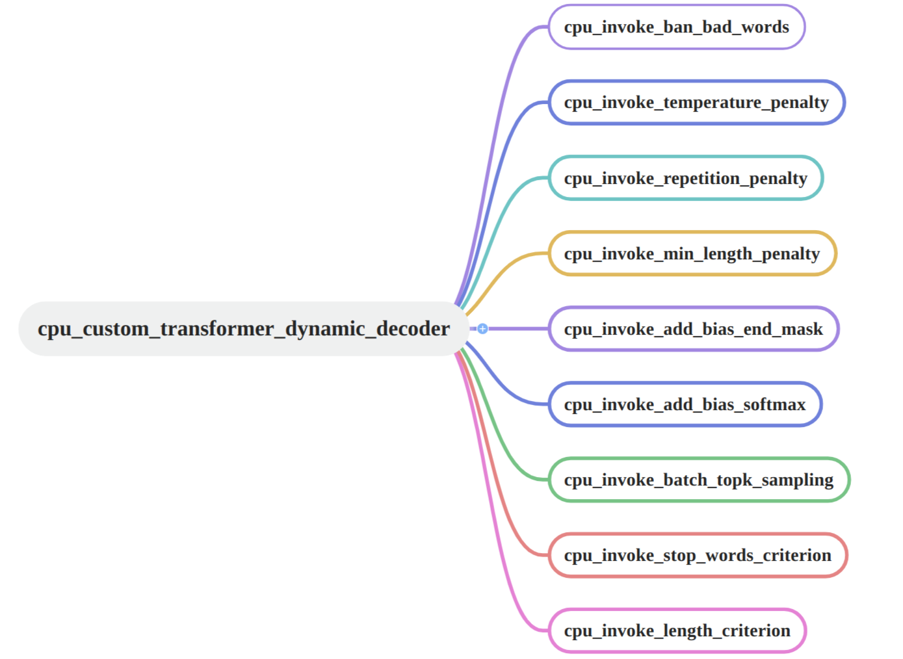

## DynamicDecoderLayer_simple

综合选取了 FasterTransformer Dynamic-Decoder-Layer 的逻辑，改写为 CPU 端 C++/Pyhton 代码，便于理解流程。

from: https://github.com/NVIDIA/FasterTransformer 




### 编译运行

cpp:
```sh
g++ dynamic_decoder_layer_cpu.cpp -o dynamic_decoder_layer_cpu
./dynamic_decoder_layer_cpu
```

python:
```sh
python dynamic_decoder_layer_cpu.py
```